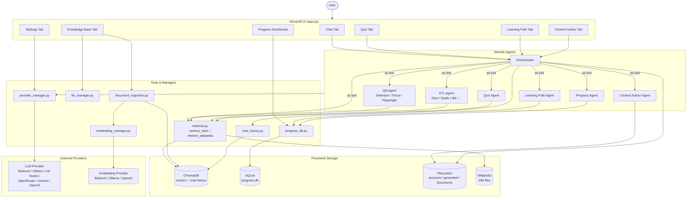
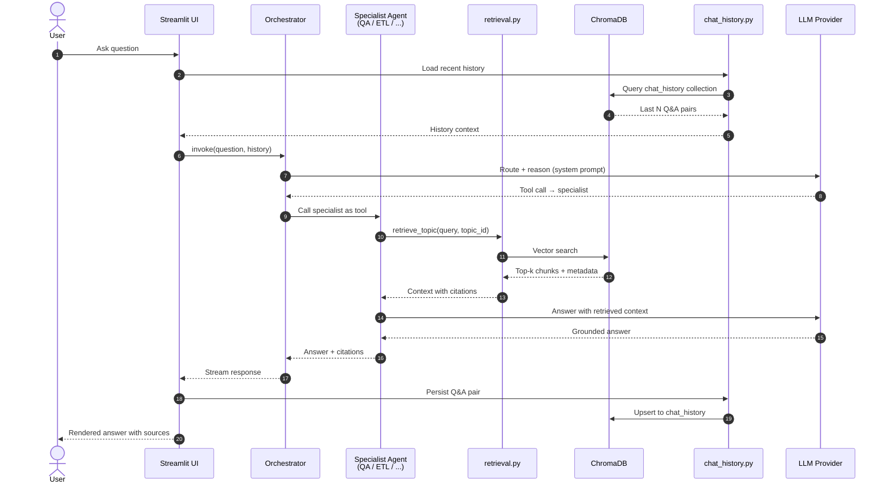

<!--
  Author : B.Vignesh Kumar aka Bravetux <ic19939@gmail.com>
  Date   : 26 March 2026
-->
# TechTrainer AI

An intelligent employee training chatbot built on the **Strands Agents SDK**. Helps employees access and navigate training materials across QA testing tools and data engineering technologies, with support for multiple AI providers.

---

## Features

- **Chat Q&A** — Ask questions about any technology; answers are cited from your training documents. Chat history is persisted across browser refreshes (last 50 exchanges stored in ChromaDB).
- **Quiz Mode** — Generate interactive multiple-choice quizzes with explanations and scoring
- **Learning Path** — Personalized study recommendations based on your quiz history
- **Content Author** — AI-generates new training modules in Markdown format
- **Knowledge Base** — Upload documents per technology topic, trigger background indexing with a progress bar and cancel button, manage custom topics
- **Progress Dashboard** — Visual sidebar showing scores by technology
- **Settings** — Switch AI provider (Bedrock, Ollama, LM Studio, OpenRouter, Gemini, OpenAI, Custom), configure embedding provider, set model parameters — all saved to `.env` / `settings.json`

---

## Technology Stack

| Layer | Technology |
|---|---|
| Frontend | Streamlit |
| Agent Framework | Strands Agents SDK |
| LLM | Configurable — AWS Bedrock (default), Ollama, LM Studio, OpenRouter, Google Gemini, OpenAI, Custom |
| LLM Adapter | `BedrockModel` (Bedrock) / `LiteLLMModel` via `litellm` (all others) |
| Embeddings | Configurable — AWS Bedrock Titan (default), Ollama, OpenAI, Custom (OpenAI-compatible) |
| Vector Store | ChromaDB (local, persistent) |
| Chat History | ChromaDB `chat_history` collection (last 50 Q&A pairs) |
| Progress Storage | SQLite |
| Session Storage | Local filesystem |
| Package Manager | uv |

---

## Quick Start

### Prerequisites
- Python 3.10+
- [uv](https://docs.astral.sh/uv/) package manager
- An AI provider (AWS Bedrock by default, or any supported alternative)

### 1. Install uv
```bash
# Windows (PowerShell)
powershell -ExecutionPolicy ByPass -c "irm https://astral.sh/uv/install.ps1 | iex"

# macOS / Linux
curl -LsSf https://astral.sh/uv/install.sh | sh
```

### 2. Clone and set up the project
```bash
cd techtrainer-ai
uv sync
```

### 3. Configure environment
```bash
cp .env.example .env
# Edit .env with your credentials, or use the Settings tab in the UI
```

### 4. Run the app
```bash
uv run streamlit run app.py
```

Open your browser to `http://localhost:8501`

### 5. Add training documents and index
- Go to the **Knowledge Base** tab
- Select a topic, upload documents, and click **Index**

Or run from the command line:
```bash
uv run python -m src.tools.document_ingestion --reindex
```

---

## Project Structure

```
techtrainer-ai/
├── .env                          # Credentials and config (not committed)
├── .env.example                  # Template for .env
├── pyproject.toml                # uv project config and dependencies
├── app.py                        # Streamlit entry point
├── data/
│   ├── documents/                # Training documents per topic
│   ├── chroma/                   # ChromaDB vector store (auto-created)
│   ├── sessions/                 # Agent session files (auto-created)
│   ├── generated/                # AI-generated training modules (auto-created)
│   ├── settings.json             # Non-sensitive settings (auto-created by UI)
│   └── progress.db               # SQLite progress database (auto-created)
├── src/
│   ├── agents/
│   │   ├── orchestrator.py       # Main routing agent
│   │   ├── qa_agent.py           # QA testing specialist
│   │   ├── etl_agent.py          # ETL/data engineering specialist
│   │   ├── quiz_agent.py         # Quiz generator
│   │   ├── learning_path_agent.py
│   │   ├── content_author_agent.py
│   │   └── progress_agent.py
│   ├── tools/
│   │   ├── provider_manager.py   # Multi-provider LLM factory + settings I/O
│   │   ├── embedding_manager.py  # Multi-provider embedding abstraction
│   │   ├── retrieval.py          # ChromaDB search tools
│   │   ├── kb_manager.py         # Knowledge base topic registry
│   │   ├── chat_history.py       # Persistent chat history (ChromaDB)
│   │   ├── progress_db.py        # SQLite progress tools
│   │   └── document_ingestion.py # Parse + embed + index pipeline
│   ├── models/
│   │   └── schemas.py            # Pydantic models
│   ├── skills/                   # AgentSkills domain knowledge files
│   │   ├── selenium.md
│   │   ├── tosca.md
│   │   ├── playwright.md
│   │   ├── aws_glue.md
│   │   ├── spark.md
│   │   ├── dbt.md
│   │   ├── informatica.md
│   │   ├── ssis.md
│   │   ├── talend.md
│   │   └── adf.md
│   ├── hooks/
│   │   └── logging_throttle.py   # Safety and logging hooks
│   └── config.py                 # Configuration loader
├── tests/
│   ├── fixtures/
│   ├── test_ingestion.py
│   ├── test_retrieval.py
│   ├── test_progress_db.py
│   ├── test_schemas.py
│   ├── test_hooks.py
│   ├── test_agents_integration.py
│   ├── test_sessions.py
│   ├── test_evals.py
│   └── test_e2e.py
└── docs/
    ├── SETUP.md
    ├── TESTPLAN.md
    ├── presentation.html
    └── superpowers/
        ├── specs/
        │   ├── 2026-03-28-techtrainer-ai-design.md
        │   ├── 2026-03-29-knowledge-base-ui-design.md
        │   ├── 2026-03-29-settings-provider-design.md
        │   ├── 2026-04-07-topic-classification-design.md
        │   └── 2026-04-07-ecs-dockerfile-design.md
        └── plans/
            ├── 2026-03-28-techtrainer-ai.md
            ├── 2026-03-29-knowledge-base-ui.md
            ├── 2026-03-29-settings-provider.md
            ├── 2026-04-07-topic-classification.md
            ├── 2026-04-07-ecs-dockerfile.md
            └── 2026-04-09-wikipedia-zim-integration.md
```

### Documentation index

| File | Purpose |
|---|---|
| [`docs/SETUP.md`](docs/SETUP.md) | Full environment setup and provider configuration guide |
| [`docs/TESTPLAN.md`](docs/TESTPLAN.md) | Test strategy, coverage matrix, and evaluation scenarios |
| [`docs/presentation.html`](docs/presentation.html) | Slide deck overview of the system |
| [`docs/superpowers/specs/2026-03-28-techtrainer-ai-design.md`](docs/superpowers/specs/2026-03-28-techtrainer-ai-design.md) | Core agent architecture and routing design |
| [`docs/superpowers/specs/2026-03-29-knowledge-base-ui-design.md`](docs/superpowers/specs/2026-03-29-knowledge-base-ui-design.md) | Knowledge Base tab UX and ingestion pipeline |
| [`docs/superpowers/specs/2026-03-29-settings-provider-design.md`](docs/superpowers/specs/2026-03-29-settings-provider-design.md) | Multi-provider LLM/embedding settings design |
| [`docs/superpowers/specs/2026-04-07-topic-classification-design.md`](docs/superpowers/specs/2026-04-07-topic-classification-design.md) | Automatic topic classification design |
| [`docs/superpowers/specs/2026-04-07-ecs-dockerfile-design.md`](docs/superpowers/specs/2026-04-07-ecs-dockerfile-design.md) | AWS ECS / Dockerfile deployment design |
| [`docs/superpowers/plans/2026-03-28-techtrainer-ai.md`](docs/superpowers/plans/2026-03-28-techtrainer-ai.md) | Initial build-out implementation plan |
| [`docs/superpowers/plans/2026-03-29-knowledge-base-ui.md`](docs/superpowers/plans/2026-03-29-knowledge-base-ui.md) | Knowledge Base UI implementation plan |
| [`docs/superpowers/plans/2026-03-29-settings-provider.md`](docs/superpowers/plans/2026-03-29-settings-provider.md) | Settings & provider switch implementation plan |
| [`docs/superpowers/plans/2026-04-07-topic-classification.md`](docs/superpowers/plans/2026-04-07-topic-classification.md) | Topic classification implementation plan |
| [`docs/superpowers/plans/2026-04-07-ecs-dockerfile.md`](docs/superpowers/plans/2026-04-07-ecs-dockerfile.md) | ECS / Dockerfile implementation plan |
| [`docs/superpowers/plans/2026-04-09-wikipedia-zim-integration.md`](docs/superpowers/plans/2026-04-09-wikipedia-zim-integration.md) | Wikipedia ZIM integration implementation plan |

---

## Configuration Reference

Configuration is read from `.env` (highest priority) → `data/settings.json` → built-in defaults.

### AI Provider (LLM)

```env
ACTIVE_PROVIDER=bedrock          # bedrock | ollama | lmstudio | openrouter | gemini | openai | custom

# AWS Bedrock
AWS_ACCESS_KEY_ID=your_access_key
AWS_SECRET_ACCESS_KEY=your_secret_key
AWS_REGION=us-east-1
BEDROCK_MODEL_ID=us.anthropic.claude-sonnet-4-20250514-v1:0
BEDROCK_GUARDRAIL_ID=            # leave empty to disable
BEDROCK_GUARDRAIL_VERSION=1

# Other providers (Ollama, LM Studio, OpenRouter, Gemini, OpenAI, Custom)
LLM_API_KEY=
LLM_BASE_URL=
LLM_MODEL=

# Model parameters
AGENT_TEMPERATURE=0.3
AGENT_TOP_P=0.9
AGENT_MAX_TOKENS=32768
```

### Embedding Provider

```env
EMBEDDING_PROVIDER=bedrock       # bedrock | ollama | openai | custom
EMBEDDING_MODEL=                 # leave empty to use provider default
EMBEDDING_BASE_URL=              # required for ollama / custom
EMBEDDING_API_KEY=               # required for openai / custom (if needed)
```

**Default embedding models:**
| Provider | Default Model |
|---|---|
| `bedrock` | `amazon.titan-embed-text-v1` |
| `ollama` | `nomic-embed-text` |
| `openai` | `text-embedding-3-small` |
| `custom` | _(user-supplied)_ |

> **Note:** Changing the embedding provider requires re-indexing all Knowledge Base collections.

### Other Settings

```env
CHROMA_PERSIST_DIR=./data/chroma
SESSIONS_DIR=./data/sessions
GENERATED_DIR=./data/generated
PROGRESS_DB=./data/progress.db
LOG_LEVEL=INFO
```

---

## Adding Training Documents

### Via the UI (recommended)
1. Open the **Knowledge Base** tab
2. Select a topic from the dropdown
3. Upload documents (PDF, DOCX, PPTX, XLSX, TXT, MD)
4. Click **Index** — a progress bar shows file-by-file progress with a **Stop** button

### Via command line
```bash
uv run python -m src.tools.document_ingestion --reindex
```

---

## Running Tests

```bash
# All unit tests
uv run pytest tests/ -v --ignore=tests/test_evals.py --ignore=tests/test_e2e.py

# With coverage report
uv run pytest tests/ -v --cov=src --cov-report=html

# Evals (requires AI provider credentials)
uv run pytest tests/test_evals.py -v -s

# Full end-to-end (requires credentials + documents)
uv run pytest tests/test_e2e.py -v --slow
```

---

## Architecture Overview

TechTrainer AI uses the **Orchestrator + Sub-Agents as Tools** pattern from Strands. The orchestrator is the only entry point; each specialist sub-agent has its own system prompt, skills, and tools and is exposed to the orchestrator as a callable tool.

### System Architecture



### Request Sequence (Chat Q&A)



See `docs/superpowers/specs/` for full design specifications.

---

## Security Notes

- Credentials are loaded from `.env` — never commit this file
- Secret keys (`AWS_SECRET_ACCESS_KEY`, `LLM_API_KEY`, `EMBEDDING_API_KEY`) are never written to `settings.json`
- The Content Author agent can only write files to `./data/generated/` (sandboxed)
- Bedrock Guardrails (optional) enforce content safety and topic restrictions
- Tool call throttling limits per-turn tool calls (prevents runaway loops)

---

## Troubleshooting

**"No documents found" in chat responses**
→ Go to the Knowledge Base tab, upload documents for the topic, and click Index.

**Bedrock throttling errors**
→ The orchestrator retries up to 3 times with exponential backoff. Check your Bedrock quotas in the AWS Console if errors persist.

**ChromaDB collection empty after restart**
→ Check `CHROMA_PERSIST_DIR` in `.env` points to a writable directory. Re-index via the Knowledge Base tab.

**Chat history not loading after browser refresh**
→ ChromaDB must be reachable and `CHROMA_PERSIST_DIR` must be writable. Check the logs for errors from `chat_history.py`.

**Embedding dimension mismatch after changing provider**
→ Re-index all collections from the Knowledge Base tab after changing `EMBEDDING_PROVIDER`.

---

*Developed by B.Vignesh Kumar — ic19939@gmail.com*
